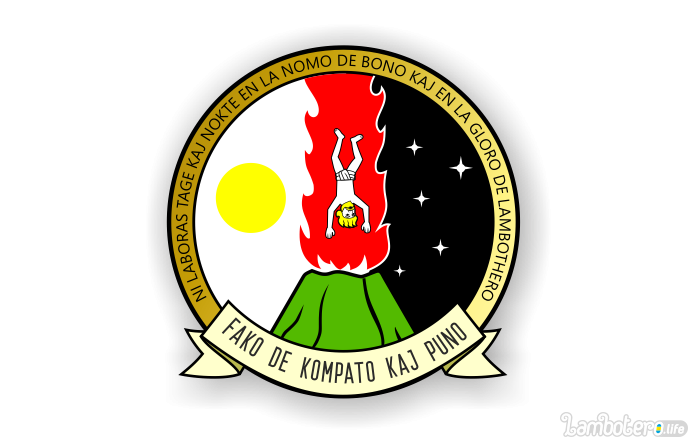

На гербе департамента изображен осужденный преступник, падающий в извергающий сноп огня, священный вулкан Шамба-Ламба.
Это олицетворение неотвратимости наказания, которое ждет каждого, преступившего священные законы Королевства.

Слева от преступника изображено солнце в зените, а справа звезная ночь.
Надпись на золотом ободе вокруг изображения гласит:
«Ni laboras tage kaj nokte en la nomo de bono kaj en la gloro de Lambothero» - «Мы работаем день и ночь во имя добра и во славу Ламботеро»

Что является девизом департамента и относит нас к тем славным временам, когда работники департамента, днем и ночью исполняли предписания суда и карали преступных грешников.

Эмблема вызывает гордость у всех законопослушных граждан Королевства и вызывает панический ужас у потенциальных преступников. А сотрудники департамента пользуются заслуженной славой и почетом среди всех жителей Ламботеро.
 