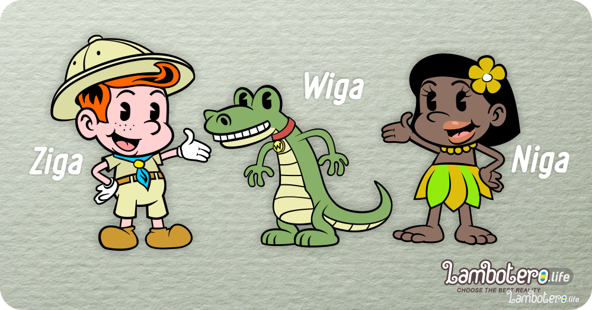

Талисманы, Маскоты Королевства Ламботеро

Почти у каждого национального государства есть свои талисманы, маскоты…иногда официальные, иногда нет.
Через национальные талисманы, государства пытаются донести свои ценности, менталитет, характер.
Священное Королевство Ламботеро уже давно использует этот инструмент мягкой силы. Правда, до начала программы Великой Интеграции талисманы использовались исключительно внутри Королевства. Но вот настал замечательный день, когда их с гордостью можно представить всему миру.
Знакомьтесь - официальные талисманы Ламботеро.

**Зига и Нига (Ziga & Niga)**__

**Ziga** - Мальчик потомок Колонистов. Любознательный, смелый и честный. Всегда придет на выручку попавшим в беде. Настоящий маленький Ламботериец.

**Niga** - Маленькая амазонка. Ловкая, отважная и очень добрая. Умеет разговаривать с животными.

А также их верный друг Вига, ну или Уига (Wiga) как кому больше нравится.

**Wiga** - дружелюбный варан. Преданный Ниге и немного ревнующий к ней Зигу.
В связи с этим у них частенько происходит соперничество и возникают различные веселые ситуации.

Наши талисманы будут помогать вновь прибывшим адептам освоится и принять чудесный мир Ламботеро.

Персонаж-талисман (маско́т, от англ. mascot — «человек, животное или объект, приносящий удачу») — узнаваемый персонаж, олицетворяющий собой некий коллектив: школу, спортивную команду, сообщество, воинское подразделение, мероприятие или бренд.

Зига и Нига, древние ламботерийские имена. Узнать больше....