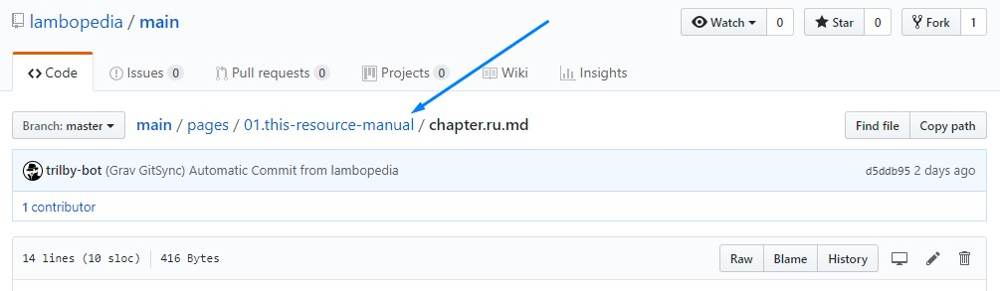
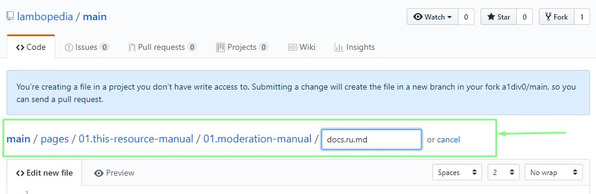
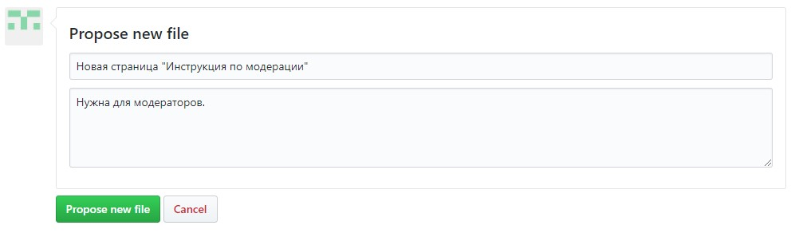

Добавять и редактировать страницы можно двумя способами:
1. Через админку сайта, используя учётную запись админки.
2. Через сайт github.
3. Через любой редактор, поддерживающий работу с github.  

## Через админку
CMS предоставляет возможность настроить права пользователя только на создание и редактирование страниц.  
Чтобы добавить страницу необходимо открыть дерево страниц через пункт меню "Страницы". После этого в верхней панели необходимо нажать кнопку "Добавить":  


+ Добавить страницу - добавляет страницу сайта.
+ Добавить папку - ?? для чего это ??

При добавлении страницы откроется форма:  


* Заголовок страницы - это название, которое описывает всю страницу и в зависимости от шаблона будет соответствующим образом отображаться. Также это название отображается во вкладках браузера.
* Имя папки - заполнять не нужно, оно заполняется автоматически. Это как будет называться директория страницы на сервере. 
* Родительская страница - позволяет определить положение создаваемой странице в иерархии сайта.
* Шаблон страницы - определяет внешний вид страницы. Более подробно - см. ниже.
* Видимая - определяет видимость страницы в панели иерархии. Можно сделать доступ к странице через панель иерархии. А можно сделать так, чтобы страницы в панели не было, и доступ к странице осуществлялся только по ссылке. Таким образом можно организовать структуру сайта, когда наиболее важные страницы собраны в некоторую структуру, а основная масса информации доступна по ссылкам внутри статей.

## Через сайт guthub
Для работы через сайт github Вам прежде всего необходимо завести учётную запись на данном портале (аккаунт).  
Для редактирования:  
1. Откройте нужную страницу ламбопедии.
2. Нажмите в верхнем правом углу ссылку "Редактировать эту страницу".
3. Нажмите кнопку с карандашиком "Edit the file in your fork of this project" ("Редактировать файл в вашем ответвлении проекта"):


Для создания новой страницы справочного портала:
1. Откройте раздел в котором будет распологаться Ваша страница.
2. Нажмите ссылку "редактировать эту страницу".
3. Перейдите в директорию раздела.


4. Нажмите кнопку "Create new file" ("Создать новый файл").


5. В адресной строке введите латинскими буквами название статьи (можно использовать символы тире). Затем введите символ "/" и "docs.ru.md" - для статьи и "chapter.ru.md" - для раздела. 

Вот примерно как это происходит:


6. В текстовое поле скопируйте шаблон текста:
``` markup
---
title: 'Здесь заголовок страницы'
visible: true
---
Здесь текст страницы
```  

И внесите текст страницы.

7. Под редактором внесите описание новой страницы для модератора и надмите кнопку "Propose new file" ("Предложить новый файл").


## Через редактор с поддержкой guthub
Рассмотрим этот способ на примере популярной программы [PhpStorm](https://www.jetbrains.com/phpstorm/).

#### Настройка окружения
1. Открываем настройки File/Settings...
1. Открываем Version control / GitHub
1. Тыкаем в поле Add account... (добавить учётную запись)
1. 

## Шаблоны страниц
Доступны следующие шаблоны станиц:  

| Шаблон | Тип | Описание |
| -------------- | -------------- | --------------- |
| Default | Контент | ? |
| Chapterer | Контент | Для создания разделов |
| Docs | Контент | Для создания статей |
| Errors | Технический | Для создания страниц, отображаемых при возникновании ошибок (403, 404, 500 и т. д.) |
| External | ? | ? |
| Form | Контент | Используется для создания форм для сббора данных от пользователей. |
| Search | Техническая | Используется в механизме поиска по сайту |
| Simplesearch result | Техническая | Используется в механизме поиска по сайту |