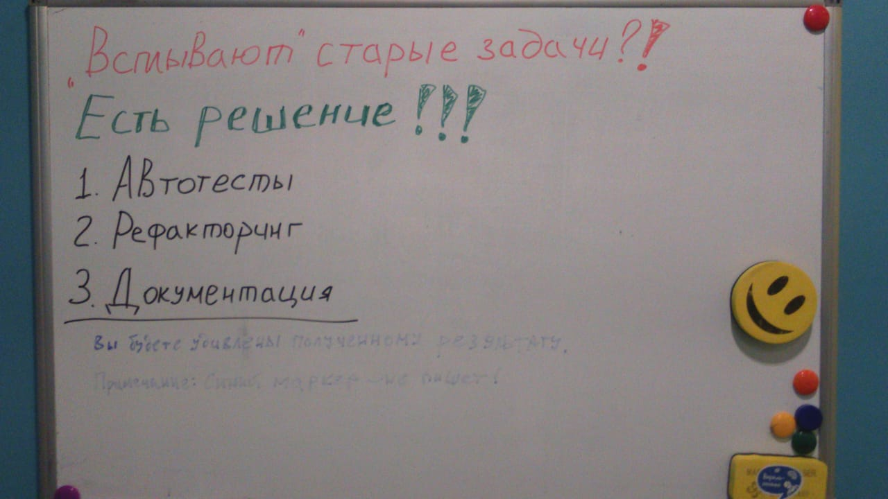

Посмотрим правде в глаза: написание контента для Интернета утомительно. Редакторы WYSIWYG помогают облегчить эту задачу, но они, как правило, приводят к ужасному коду или, что еще хуже, уродливым веб-страницам.  

>>> WYSIWYG редакторы - это редакторы, у которых оформление и при редактировании и при чтении одинаковое.

[Markdown](https://ru.wikipedia.org/wiki/Markdown) - это лучший способ оформить страницу, безо всяких сложностей и по единому для всех страниц стандарту. Некоторые из ключевых преимуществ:  
+ Markdown прост в освоении, с минимальными дополнительными символами, поэтому он помогает быстрее формировать контент. Вам не нужно отвлекаться на настройку необходимого оформления.
+ Сохраняет содержимое и визуальный результат отдельно друг от друга, поэтому вы не можете испортить внешний вид своих страниц.
+ Можно использовать любой текстовый редактор или приложение с поддержкой Markdown.

# Акцент
Для того, чтобы выделить текст **полужирным**, необходимо написать: `**полужирным**`.  
Для того, чтобы выделить текст _курсивом_, необходимо написать: `_курсивом_`.  
Есть ещё ~~зачёркнутый текст~~, чтобы его получить, необходимо написать: `~~зачёркнутый текст~~`.  

# Перенос строк
Почему-то в Markdown-е для переноса строк недостаточно поставить ENTER. Нужно ещё обязательно в конце строки поставить два пробела: `  `.

# Заголовки
Чтобы сделать заголовок верхнего уровня, достаточно поставить символ `#` и написать текст заголовка. Если это подзаголовок, то нужно поставить `##`. Если это подподзаголовок - `###` и так далее.
Если написать вот такой блок текста:
```
# Заголовок
## Подзаголовок
### Подподзаголовок
#### Врядли это понадобится
##### Это точно вряд ли понадобится
###### Этот тип заголовка точно не понадобится
```
То на странице мы увидим следующее:
# Заголовок
## Подзаголовок
### Подподзаголовок
#### Врядли это понадобится
##### Это точно вряд ли понадобится
###### Этот тип заголовка точно не понадобится

# Комментарии к тексту
Как и в языке HTML, в тексте можно оставлять комментарии, которые будут видны только при редактировании. Если написать:
```
<!--
Это комментарий к тексту. Например здесь может быть написано: "Дописать здесь то-то и то-то".
-->
```
То на странице мы увидим:
<!--
Это комментарий к тексту. Например здесь может быть написано: "Дописать здесь то-то и то-то".
-->

# Горизонтальные разделители
Весь текст страницы можно разделить на части с помощью горизонтальных разделителей. Разделитель можно поставить любым из следующих способов:
```  
___
---
***
```
Выглядит это вот так:
___
---
***

# Информационные блоки
## Цитаты
Markdown позволяет очень лекго вставлять цитаты. Чтобы добавить цитату, необходимо перед текстом цитаты поставить символ: `>`. Например если набрать:
```
> Markdown первоначально создан в 2004 году Джоном Грубером (англ. John Gruber) и Аароном Шварцем.
Многие идеи языка были позаимствованы из существующих соглашений по разметке текста в электронных 
письмах. Реализации языка Markdown преобразуют текст в формате Markdown в валидный, правильно 
построенный XHTML и заменяют левые угловые скобки («<») и амперсанды («&») на соответствующие коды 
сущностей. Первой реализацией Markdown стала написанная Грубером реализация на Perl, однако спустя 
некоторое время появилось множество реализаций от сторонних разработчиков. Реализация на Perl 
распространяется по лицензии типа BSD. Реализации Markdown на различных языках программирования 
включены (или доступны в качестве плагина) во многие системы управления содержимым.
```
То из этого получится вот такая цитата:
> Markdown первоначально создан в 2004 году Джоном Грубером (англ. John Gruber) и Аароном Шварцем.
Многие идеи языка были позаимствованы из существующих соглашений по разметке текста в электронных письмах. Реализации языка Markdown преобразуют текст в формате Markdown в валидный, правильно построенный XHTML и заменяют левые угловые скобки («<») и амперсанды («&») на соответствующие коды сущностей. Первой реализацией Markdown стала написанная Грубером реализация на Perl, однако спустя некоторое время появилось множество реализаций от сторонних разработчиков. Реализация на Perl распространяется по лицензии типа BSD. Реализации Markdown на различных языках программирования включены (или доступны в качестве плагина) во многие системы управления содержимым.

Также может понадобиться процитировать цитату:
```
> Цитирую другую цитату:
>> Собственно другая цитата.
```
Из этого получится вот такая конструкция:
> Цитирую другую цитату:
>> Собственно другая цитата.

## Цветные стикеры
С помощью треугольных скобок, кроме цитат, в текст можно добавлять крайне полезные информационные блоки. Такие как:
```
>>> Просто информационный блок. Он жёлтый.
```
>>> Просто информационный блок. Он жёлтый.

```
>>>> ВНИМАНИЕ! Находится под напряжением! Этот информационный блок красный.
```
>>>> ВНИМАНИЕ! Находится под напряжением! Этот информационный блок красный.

```
>>>>> Информационный блок ЗАМЕТКА. Он синий.
```
>>>>> Информационный блок ЗАМЕТКА. Он синий.

```
>>>>>> Информационный блок СОВЕТ. Он зелёный.
```
>>>>>> Информационный блок СОВЕТ. Он зелёный.

Можно ещё вот такие блоки добавлять:  
`! Оранжевый`

! Оранжевый

`!! Красный`

!! Красный

`!!! Синий`

!!! Синий

`!!!! Зелёный`

!!!! Зелёный

# Списки <a id="lists"></a>

## Маркированный список
Ненумерованные списки добавляются просто:  
```
+ Пункт 1
+ Пункт 2
    - Подпункт 2.1
        + Подподпункт 2.1.1
        + Подподпункт 2.1.2
    - Подпункт 2.2
+ Пункт 3
```

Выглядит это вот так:  
+ Пункт 1
+ Пункт 2
    - Подпункт 2.1
        + Подподпункт 2.1.1
        + Подподпункт 2.1.2
    - Подпункт 2.2
+ Пункт 3  

Знак `+` или `-` означает значок списка. Уровень списка регулируется количеством TAB-ов перед значком списка.  

## Нумерованный список
Нумерованный список создаётся по тому же принципу, только вместо значка пишем цифру с точкой:
```
1. Пункт 1
2. Пункт 2
    2.1. Подпункт 2.1
        2.1.1. Подподпункт 2.1.1
        2.1.2. Подподпункт 2.1.2
    2.2. Подпункт 2.2
3. Пункт 3
```

В результате получится это:
1. Пункт 1  
2. Пункт 2  
    2.1. Подпункт 2.1  
        2.1.1. Подподпункт 2.1.1  
        2.1.2. Подподпункт 2.1.2  
    2.2. Подпункт 2.2  
3. Пункт 3  

>>>>>> Совет. В списке можно использовать всегда единичку: `1.`, тогда система всегда будет нумеровать список автоматически. Пример: см. ниже.

## Нумерованный список с автоматической нумерацией
Пример с автонумерацией:
```
1. Пункт 1
1. Пункт 2
1. Пункт 3
```

Результат:
1. Пункт 1
1. Пункт 2
1. Пункт 3

# Вставки кода <a id="src"></a>
## Код в тексте

Чтобы вставить код в текст необходимо использовать знак ` ` `:
```
В данном тексте присутствует `вставка кода`, которая оформляется **соответствующим** образом.
```

В результате мы получим:
В данном тексте присутствует `вставка кода`, которая оформляется **соответствующим** образом.

## Код в отдельном блоке
Чтобы вставить несколько строк обычного текста в блок, необходимо орамлять вначале и в конце трёмя знаками ` ``` `:
<pre>
``` markup
{
    "status": "success",
    "data": [
        {
            "event": "add",
            "id": 911577,
            "text": "Добавлен новый бренд ID 911577"
        }
    ]
}
```
</pre>

``` markup
{
    "status": "success",
    "data": [
        {
            "event": "add",
            "id": 911577,
            "text": "Добавлен новый бренд ID 911577"
        }
    ]
}
```
>>>>>> Кроме того, можно использовать такую конструкцию: `<pre>Многострочный текст</pre>`

## Подсветка синтаксиса
Для подсветки синтаксиса достаточно просто указать язык кода, приведённого внутри блока:
<pre>
``` json
{
    "status": "success",
    "data": [
        {
            "event": "add",
            "id": 911577,
            "text": "Добавлен новый бренд ID 911577"
        }
    ]
}
```
</pre>

Результат:
``` json
{
    "status": "success",
    "data": [
        {
            "event": "add",
            "id": 911577,
            "text": "Добавлен новый бренд ID 911577"
        }
    ]
}
```

# Таблицы <a id="tables"></a>
## Базовый вариант
Для построения таблиц используются вертикальные линии и тире:  
``` markup
| Option | Description |
| ------ | ----------- |
| data   | path to data files to supply the data that will be passed into templates. |
| engine | engine to be used for processing templates. Handlebars is the default. |
| ext    | extension to be used for dest files. |
```

В результате получается это:  
  
| Option | Description |
| ------ | ----------- |
| data   | path to data files to supply the data that will be passed into templates. |
| engine | engine to be used for processing templates. Handlebars is the default. |
| ext    | extension to be used for dest files. |  
  
  
## Добавить выравнивание по правому краю
Для этого необходимо использовать двоеточие:
``` markup
| Option | Description |
| ------: | -----------: |
| data   | path to data files to supply the data that will be passed into templates. |
| engine | engine to be used for processing templates. Handlebars is the default. |
| ext    | extension to be used for dest files. |
```

В результате получается это:  
  
| Option | Description |
| ------: | -----------: |
| data   | path to data files to supply the data that will be passed into templates. |
| engine | engine to be used for processing templates. Handlebars is the default. |
| ext    | extension to be used for dest files. |  
  
# Ссылки
## Базовый вариант
```
[Методология БЭМ](https://ru.bem.info)
```
В итоге получим:
[Методология БЭМ](https://ru.bem.info)

## Со всплывающей подсказкой
```
[Методология БЭМ](https://ru.bem.info "БЭМ (Блок, Элемент, Модификатор) — компонентный подход к веб-разработке, в основе которого лежит принцип разделения интерфейса на независимые блоки. ")
```
В итоге получим:  
[Методология БЭМ](https://ru.bem.info "БЭМ (Блок, Элемент, Модификатор) — компонентный подход к веб-разработке, в основе которого лежит принцип разделения интерфейса на независимые блоки. ")

# Именованые якорные-ссылки
Якорные ссылки - это инструмент, позволяющий быстро перемещаться по странице. Вы размещаете на странице специальные метки и размещаете специальные ссылки, которые перемещают пользователя к этим меткам.

Метки указываем так:  
```
<a id="label-1"></a>
```
Напимер можно использовать так:
```
# Списки <a id="lists"></a>
. . .
# Вставки кода <a id="src"></a>
. . .
# Таблицы <a id="tables"></a>
```
Сами якорные ссылки указываем так:
```
  * [Списки](#lists)
  * [Вставки кода](#src)
  * [Таблицы](#tables)
```
Получается вот это:
  * [Списки](#lists)
  * [Вставки кода](#src)
  * [Таблицы](#tables)

>>>>> Как и в базовом варианте этим ссылкам можно давать всплывающую подсказку

# Картинки
Картинки оформляем так же как и ссылки, только вначале ставим восклицательный знак, вот так:  
``  
или можно добавить ещё всплывающую подсказку:  
``  


Картинки можно хранить на странице, а можно ссылаться на картинку из интернета:  
``


Так же как и ссылка, картинка может быть оформлена как сноска. Сначала объявляем саму картинку:  
`![Здесь текст описывающий картинку, если картинка не подгрузится][ИдентификаторКартинки]`  

![Здесь текст описывающий картинку, если картинка не подгрузится][ИдентификаторКартинки]  

А в конце страницы объявляем, откуда её брать:  
`[ИдентификаторКартинки]: http://octodex.github.com/images/dojocat.jpg  "The Dojocat"`

[ИдентификаторКартинки]: http://octodex.github.com/images/dojocat.jpg  "The Dojocat"

# Функциональные диаграммы
Размещая [Nomnoml-диаграмму](https://github.com/OleVik/grav-plugin-nomnoml-uml-diagrams) на странице, заключайте её в теги `[nom]...[/nom]`:  

```  
[nom]
[Pirate|eyeCount: Int|raid();pillage()|
  [beard]--[parrot]
  [beard]-:>[foul mouth]
]

[<abstract>Marauder]<:--[Pirate]
[Pirate]- 0..7[mischief]
[jollyness]->[Pirate]
[jollyness]->[rum]
[jollyness]->[singing]
[Pirate]-> *[rum|tastiness: Int|swig()]
[Pirate]->[singing]
[singing]<->[rum]

[<start>st]->[<state>plunder]
[plunder]->[<choice>more loot]
[more loot]->[st]
[more loot] no ->[<end>e]

[<actor>Sailor] - [<usecase>shiver me;timbers]
[/nom]
```
В результате получится вот такая диаграмма:  
[nom][Grav]->[Awesome][/nom]  


[nom]
[Pirate|eyeCount: Int|raid();pillage()|
  [beard]--[parrot]
  [beard]-:>[foul mouth]
]

[<abstract>Marauder]<:--[Pirate]
[Pirate]- 0..7[mischief]
[jollyness]->[Pirate]
[jollyness]->[rum]
[jollyness]->[singing]
[Pirate]-> *[rum|tastiness: Int|swig()]
[Pirate]->[singing]
[singing]<->[rum]

[<start>st]->[<state>plunder]
[plunder]->[<choice>more loot]
[more loot]->[st]
[more loot] no ->[<end>e]

[<actor>Sailor] - [<usecase>shiver me;timbers]
[/nom]
