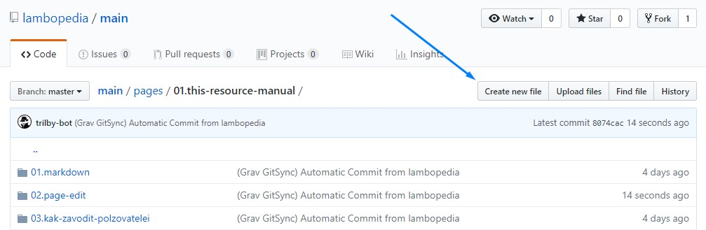

Добавять и редактировать страницы можно двумя способами: 444
1. Через админку сайта, используя учётную запись админки.
2. Через сайт github.
3. Через любой редактор, поддерживающий работу с github.  


## Через сайт guthub
. . .  
Для создания новой страницы справочного портала:
1. Откройте раздел в котором будет распологаться Ваша страница.
2. Нажмите ссылку "редактировать эту страницу".
3. Перейдите в директорию раздела.


4. Нажмите кнопку "Create new file" ("Создать новый файл").


5. В адресной строке введите латинскими буквами название статьи (можно использовать символы тире). Затем введите символ "/" и "docs.ru.md" - для статьи и "chapter.ru.md" - для раздела. 

Вот примерно как это происходит:


6. В текстовое поле скопируйте шаблон текста и внесите содержиое страницы:
``` markup
---
title: 'Здесь заголовок страницы'
visible: true
---
Здесь текст страницы
```  

7. Под редактором внесите описание новой страницы для модератора и надмите кнопку "Propose new file" ("Предложить новый файл").

7. Далее необходимо запросить у модераторов внести изменения на сайт. Для этого или сразу нажимаем "Pull request". Или нажимаем "branches". И далее кнопку "Pull request" напротив готовых изменений. Изменения появятся после одобрения модератором. Редактируем описание, если необходимо. Нажимаем "Pull request".
8. Если параллельно с Вами кто-то внёс изменения в страницу раньше Вас, появится блок предупреждающий об этом. В этом случае необходимо нажать кнопку "Resolve conflicts" и отредактировать изменения. После чего необходимо нажать кнопку "Mark as resolved".

## Через редактор с поддержкой guthub
Рассмотрим этот способ на примере популярной программы [PhpStorm](https://www.jetbrains.com/phpstorm/).

#### Настройка окружения
1. Открываем настройки File/Settings...
1. Открываем Version control / GitHub
1. Тыкаем в поле Add account... (добавить учётную запись)

>>>> Подраздел находится в разработке


