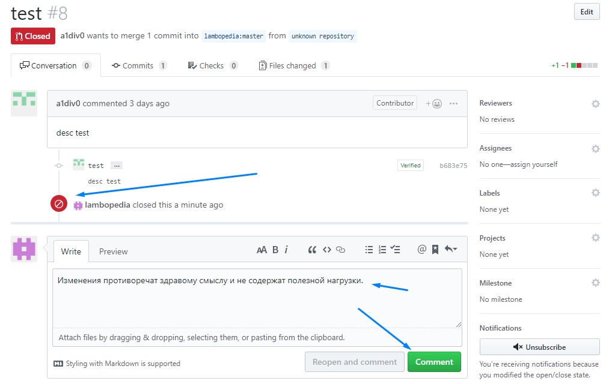

Справочный портал позволяет редактировать страницы всем желающим. Делать это можно через популярный сервис GitHub. Все изменения проходят премодерацию.  
Обязанности можератора:
* Защищать справочный портал от вандализма;
* Защищать справочный портал от орфографических и грамматических ошибок, от нецензурной брани;
* От демонстрации запрещённых законом символик.

## Как проверять
Премодерация осуществляется следующим образом:
1. Откройте репозиторий Ламбопедии.
2. Откройте вкладку "Pull requests". Откроется список изменений ожидающих модерации.

3. Зайдите в каждое и посмотрите предлагаемые изменения. Здесь же можно написать комментарий автору. Можно закрыть изменения не принимая (кнопка "Close pull request"). При этом необходимо обязательно оставить комментарий.

4. Если с изменениями всё в порядке, нажимаем зелёную кнопку "Merge pull request". Затем подтверждаем своё намерение, нажав "Confirm merge". Появится значок, означающий, что изменения добавлены на справочный портал. Автору придёт уведомление об этом.

