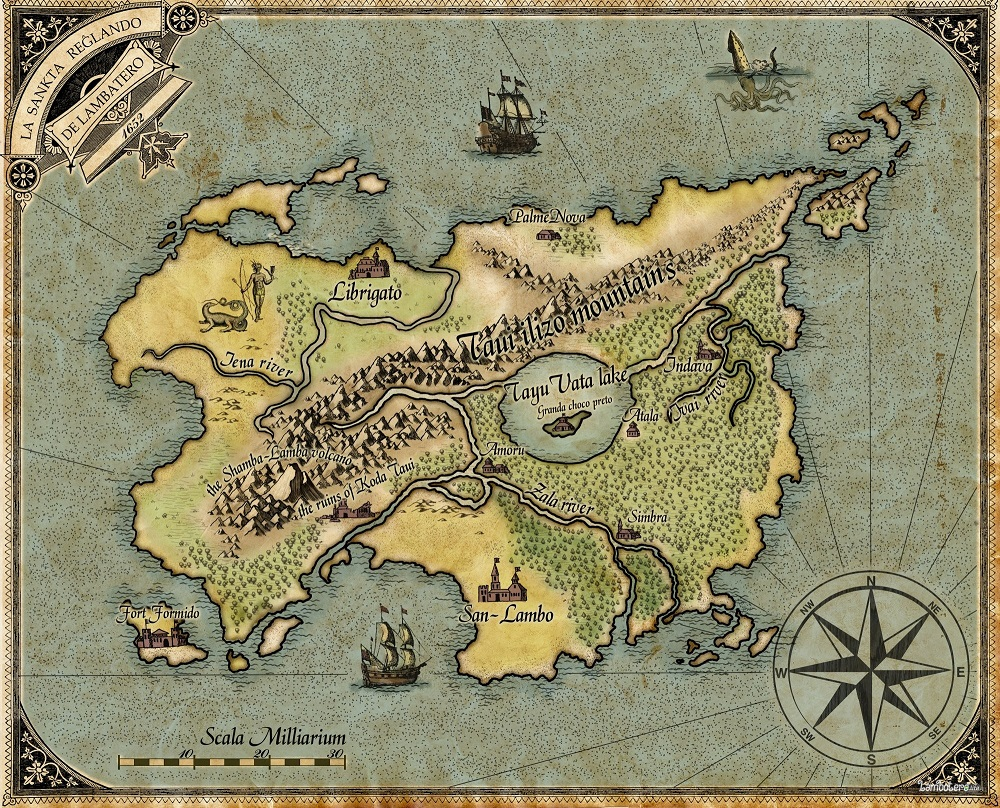

Первое квантовое государство. Священное Королевство Ламботеро - небольшое островное государство в Тихом Океане.

Название Ламботеро произошло от слова Л`аам боа-таар, что на древнем наречии аборигенов острова означает "Земля охраняющая огонь".

    Форма правления: Абсолютная Монархия.
    Король: Король Альшубарот Единый Фортунату да Кунья по прозвищу "Пылающий Пыштень".
    Столица: город Сан-Ламбо.
    Площадь острова: 9 657 кв км.
    Численность населения: 12 тыс. (данные на 1716 г.)
    Государственные языки: Ламботерийский, Русский и Английский.
    Религия: учение Юниатри.

В 2018 году, его [Величеством Королем Альшубаротом Единым](http://lambopedia.mak-radio.nichost.ru/ru/svyashennoe-korolevstvo-lambotero/korol-alshubarot), в связи с принятием политики большей открытости и прозрачности, было решено изменить форму правления с Абсолютной Монархии на Конституционную. В связи с чем разрабатывается Конституция Королевства, которую планируется принять в 2019 году, через народное голосование на общенациональном референдуме.

В 2019 году впервые в истории страны состоятся национальные выборы парламента Королевства.
Особенностью Королевства является своеобразная форма демократии([Ламбократия](http://lambopedia.mak-radio.nichost.ru/svyashennoe-korolevstvo-lambotero/lambokratiya)). Все граждане Ламботеро имеют право участвовать в выборах, но сила голоса при этом у них зависит от социального статуса. Который является выражением их достижений на благо народа Ламботеро и Королевства. Голосовать граждане могут с 14 лет, избираться в органы власти с 18.

Политика и Экономика
Ламботеро не состоит ни в каких военных или политических блоках и союзах. И проводит самостоятельную независимую политику. До настоящего момента, Королевство Ламботеро не имело официальных экономических и политических связей с другими государствами. Так как не признавало их. Но в последние годы наметилась тенденция отхода от изоляционизма и установлению дипломатических контактов с другими странами.

Культура
Богатые национальные, религиозные и культурные традиции, представляют из себя необычное сочетание культурного наследия аборигенов с западноевропейской культурой. Оригинальная национальная кухня. Народные промыслы, музыкальные инструменты и предметы быта. Народные фестивали и национальные праздники.

Национальные праздники Королевства Ламботеро.

    2 июля - День независимости. Основание Королевства Ламботеро. (Главный праздник)
    18 мая - День Великой Интеграции.
    8 февраля - Праздник освобождения от матриархата и установления патриархального социального строя.
    4 июля - День казни верховных матерей.
    27 мая - День послушания.
    1 сентября - Религиозный праздник. Недельный фестиваль Космической Любви.

Национальные символы Королевства Ламботеро.

Герб Ламботеро представляет собой узорный щит, разделённый на четыре части с заострением внизу.
В первой четверти на красном фоне находится изображение двух секир и одного двуручного меча. Это излюбленное оружие ламботерийских воинов, с которым они выиграли множество битв.
Во второй четверти на фоне цветов национального флага изображен цветок «Belanokta vita» из которого, по преданию вышли первые жители острова.
В третьей четверти на голубом фоне находится изображение священного вулкана Шамба-Ламба.
В четвертой четверти на красном фоне находятся изображения цепей с нанизанными на них блоками первоблокчейна, с помощью которого испокон веков записывалась вся важная информация королевства.
Слева щит поддерживает ламботерийский воин эпохи завоеваний, который олицетворяет силу и могущество королевства, а справа — амазонка, символизирующая чистоту и верность.
Щит увенчан королевской короной, Корона принадлежит ламботерийскому монаршему роду и является символом высокого достоинства, и благородного происхождения.
По краям герб обрамляет растение Cannabis sativa, являющееся очень важным в культуре и промышленности королевства. У подножья находятся грибы которые издревле используются в различных магических и религиозных ритуалах и обрядах жителей Ламботеро.
Снизу герб обвивает девизная лента, на которой нанесена надпись: «La sankta reglando de Lambotero» (в переводе - «Священное королевство Ламботеро»)
Национальный герб королевства Ламботеро отображает историю государства, его славные традиции, характер и дух его народа.

Государственный флаг королевства Ламботеро - это прямоугольное полотнище состоит из трёх горизонтальных полос - двух равновеликих голубых, верхней и нижней, между которыми расположена жёлтая полоса, ширина которой в два раза больше каждой голубой полосы. На жёлтой полосе в центре расположено символическое изображение цветка «Belanokta vita».

Голубые полосы означают безоблачное небо и бескрайнее море, которые окружают королевство. Центральная полоса, по преданию, означает золотой песок пляжей (И это не совсем образное выражение, веками на песок намывало золотые крупицы. Поэтому на солнце пески Ламботеро искрятся и сверкают) Первые конкистадоры, были изумлены невероятной красотой песчаных пляжей острова.

Цветок «Belanokta vita» - священный цветок Ламботеро. По легенде Первобог осеменил земли острова и из его семени произросли черные цветы, а уже из цветов и появились первые жители.

Флаг овеян славой тысяч великих подданных королевства и вызывает священный трепет у каждого жителя Ламботеро.