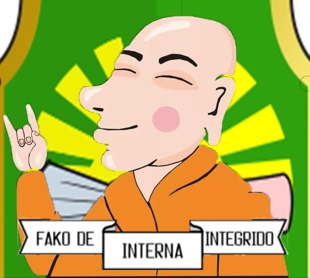

Эт-Эрил или просто Дед. (ударение на второе Э)

Просто старый дед, сидящий под пальмой и покуривающий свою странную смесь из толченых листьев Belanokta vita, козьего гумуса и еще пары-тройки чего-то там (он не говорит).
Большую часть времени он невнятно бормочет (уж не пророчества ли?) Впрочем иногда на него находит, он вскакивает, восхваляет правителя или же наоборот хулит его, пытается шутить (иногда даже внятно), петь или донести какую-то мысль и снова садится под пальму.
Вреда от него никакого, пользы впрочем тоже. Десятка два граждан (поговаривают, что среди них есть очень уважаемые люди) - считают его пророком, остальные - просто юродивым.
 
[с момента открытия королевства миру назначен комиссаром департамента Внутренней Интеграции личным указом Короля)](http://lambopedia.ru/svyashennoe-korolevstvo-lambotero/nashi-ministerstva/ministerstvo-integracii/departament-vnutrennei-integracii/et-eril/kak-et-eril-stal-komissarom)