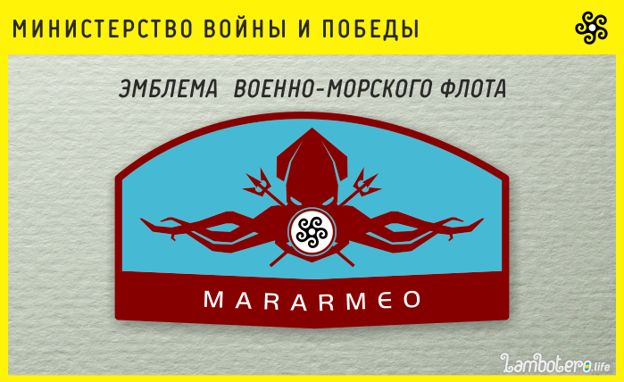

Эмблема Военно-Морского Флота Ламботеро представляет собой изображение Ламботерийского Кальмара [Infera araho] т.н. «багряного» или «адского паука», держащего 2 боевых трезубца и круглый щит с изображением черного цветка Estronegro.

Ламботерийский багряный кальмар – один из свирепейших морских хищников прибрежных вод Ламботеро. Известен хитроумным способом ловли своих жертв в, так называемую, морскую паутину – особую слизь выбрасываемую из клоаки кальмара. «Паутина» полимеризуется в воде и сковывает жертву, делая ее беспомощной перед хищником.

Девиз ВМФ - La sango de malamikoj estas nia maro (Кровь врагов - наше море)
Наши доблестные военно-морские силы всегда стояли на службе интересов Королевства и готовы в любой момент, в любой точке Мирового Океана донести до варваров нашу справедливую точку зрения!